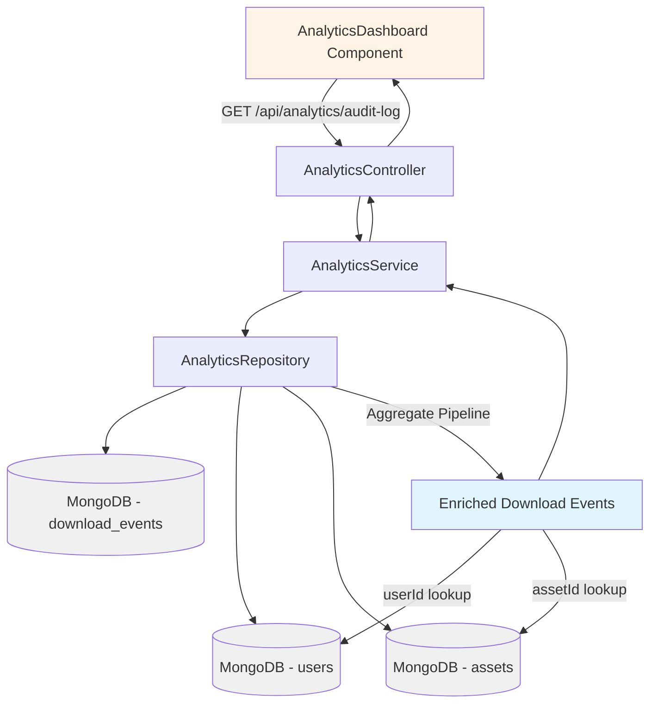
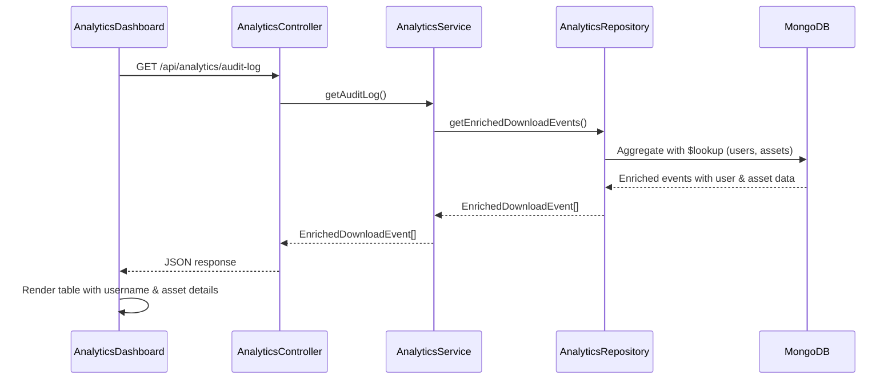
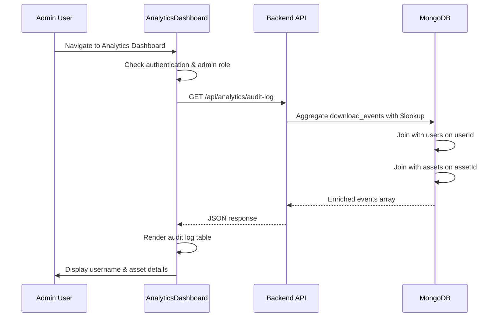

# Design Document: Analytics Display Improvement

## Overview

The analytics dashboard currently displays raw technical identifiers (session IDs and asset IDs) which are not human-readable. This feature enhances the analytics display by enriching download events with user information (username or "Anonymous") and asset details (name and category) instead of showing raw IDs. The improvement requires backend API changes to join user and asset data with download events, and frontend updates to display the enriched information in a user-friendly format.

## Architecture



## Sequence Diagram



## Components and Interfaces

### Component 1: AnalyticsRepository (Backend)

**Purpose**: Fetch download events enriched with user and asset information using MongoDB aggregation pipeline.

**Interface**:
```typescript
interface AnalyticsRepository {
  getEnrichedDownloadEvents(limit?: number): Promise<EnrichedDownloadEvent[]>
}
```

**Responsibilities**:
- Execute MongoDB aggregation pipeline with $lookup joins
- Join download_events with users collection on userId
- Join download_events with assets collection on assetId
- Handle null userId (anonymous users)
- Return enriched download events sorted by timestamp (descending)

### Component 2: AnalyticsService (Backend)

**Purpose**: Business logic layer for analytics operations.

**Interface**:
```typescript
interface AnalyticsService {
  getAuditLog(limit?: number): Promise<EnrichedDownloadEvent[]>
}
```

**Responsibilities**:
- Delegate to repository for data fetching
- Apply business rules if needed
- Return enriched download events

### Component 3: AnalyticsController (Backend)

**Purpose**: HTTP endpoint handler for audit log requests.

**Interface**:
```typescript
interface AnalyticsController {
  getAuditLog(req: Request, res: Response, next: NextFunction): Promise<void>
}
```

**Responsibilities**:
- Handle GET /api/analytics/audit-log endpoint
- Extract query parameters (limit)
- Call service layer
- Return JSON response

### Component 4: AnalyticsDashboard Component (Frontend)

**Purpose**: Display enriched audit log in a human-readable table.

**Interface**:
```typescript
interface AnalyticsDashboardProps {}
```

**Responsibilities**:
- Fetch enriched download events from API
- Display audit log table with columns: Timestamp, User, Asset Details, IP Address
- Show username or "Anonymous" for user column
- Show "asset name (category)" for asset details column
- Handle loading and error states

## Data Models

### Model 1: EnrichedDownloadEvent (New)

```typescript
interface EnrichedDownloadEvent {
  id: string
  assetId: string
  assetName: string
  assetCategory?: string
  userId?: string
  username?: string
  sessionId: string
  timestamp: Date
  ipAddress?: string
}
```

**Validation Rules**:
- `id` must be non-empty string
- `assetId` must be non-empty string
- `assetName` must be non-empty string
- `timestamp` must be valid Date
- `username` is optional (null for anonymous users)
- `assetCategory` is optional (may not exist for all assets)

### Model 2: DownloadEvent (Existing - No Changes)

```typescript
interface DownloadEvent {
  id: string
  assetId: string
  assetName: string
  userId?: string
  sessionId: string
  timestamp: Date
  ipAddress?: string
}
```

**Note**: This model remains unchanged. The enrichment happens at query time via aggregation.

## Main Algorithm/Workflow



## Key Functions with Formal Specifications

### Function 1: getEnrichedDownloadEvents()

```typescript
async getEnrichedDownloadEvents(limit: number = 100): Promise<EnrichedDownloadEvent[]>
```

**Preconditions:**
- MongoDB connection is established and healthy
- `limit` is a positive integer (default: 100)
- Collections `download_events`, `users`, and `assets` exist

**Postconditions:**
- Returns array of EnrichedDownloadEvent objects
- Array is sorted by timestamp in descending order (newest first)
- Each event has `username` populated if `userId` exists in users collection
- Each event has `assetCategory` populated if `assetId` exists in assets collection
- Anonymous users (no userId) have `username` as null/undefined
- Array length ≤ limit

**Loop Invariants:** N/A (aggregation pipeline, not iterative)

### Function 2: getAuditLog()

```typescript
async getAuditLog(limit?: number): Promise<EnrichedDownloadEvent[]>
```

**Preconditions:**
- AnalyticsRepository is properly initialized
- `limit` is undefined or a positive integer

**Postconditions:**
- Returns array of EnrichedDownloadEvent objects
- Delegates to repository.getEnrichedDownloadEvents()
- Returns same data structure as repository method

**Loop Invariants:** N/A (single delegation call)

### Function 3: fetchAuditLog() (Frontend)

```typescript
async fetchAuditLog(): Promise<void>
```

**Preconditions:**
- User is authenticated as admin
- API endpoint /api/analytics/audit-log is available
- Auth token exists in localStorage

**Postconditions:**
- On success: `auditLog` state is populated with EnrichedDownloadEvent[]
- On error: `error` state contains error message
- `loading` state is set to false after completion
- UI re-renders with new data

**Loop Invariants:** N/A (single async operation)

## Algorithmic Pseudocode

### Main Processing Algorithm: MongoDB Aggregation Pipeline

```typescript
ALGORITHM getEnrichedDownloadEvents(limit)
INPUT: limit of type number (default: 100)
OUTPUT: enrichedEvents of type EnrichedDownloadEvent[]

BEGIN
  ASSERT limit > 0
  ASSERT mongoConnection.isConnected() = true
  
  // Step 1: Define aggregation pipeline
  pipeline ← [
    // Stage 1: Convert userId string to ObjectId for lookup
    {
      $addFields: {
        userObjectId: {
          $convert: {
            input: "$userId",
            to: "objectId",
            onError: null,
            onNull: null
          }
        }
      }
    },
    
    // Stage 2: Convert assetId string to ObjectId for lookup
    {
      $addFields: {
        assetObjectId: {
          $convert: {
            input: "$assetId",
            to: "objectId",
            onError: null,
            onNull: null
          }
        }
      }
    },
    
    // Stage 3: Lookup user information
    {
      $lookup: {
        from: "users",
        localField: "userObjectId",
        foreignField: "_id",
        as: "userDetails"
      }
    },
    
    // Stage 4: Lookup asset information
    {
      $lookup: {
        from: "assets",
        localField: "assetObjectId",
        foreignField: "_id",
        as: "assetDetails"
      }
    },
    
    // Stage 5: Unwind user details (preserve null)
    {
      $unwind: {
        path: "$userDetails",
        preserveNullAndEmptyArrays: true
      }
    },
    
    // Stage 6: Unwind asset details (preserve null)
    {
      $unwind: {
        path: "$assetDetails",
        preserveNullAndEmptyArrays: true
      }
    },
    
    // Stage 7: Project final structure
    {
      $project: {
        _id: 0,
        id: 1,
        assetId: 1,
        assetName: 1,
        assetCategory: "$assetDetails.category",
        userId: 1,
        username: "$userDetails.username",
        sessionId: 1,
        timestamp: 1,
        ipAddress: 1
      }
    },
    
    // Stage 8: Sort by timestamp descending
    {
      $sort: { timestamp: -1 }
    },
    
    // Stage 9: Limit results
    {
      $limit: limit
    }
  ]
  
  // Step 2: Execute aggregation
  enrichedEvents ← downloadsCollection.aggregate(pipeline).toArray()
  
  ASSERT enrichedEvents.length ≤ limit
  ASSERT enrichedEvents is sorted by timestamp descending
  
  RETURN enrichedEvents
END
```

**Preconditions:**
- limit > 0
- MongoDB connection is active
- Collections exist: download_events, users, assets

**Postconditions:**
- enrichedEvents.length ≤ limit
- All events are sorted by timestamp (descending)
- Each event has username populated if user exists
- Each event has assetCategory populated if asset exists

**Loop Invariants:**
- N/A (aggregation pipeline executes atomically)

### Frontend Rendering Algorithm

```typescript
ALGORITHM renderAuditLogTable(auditLog)
INPUT: auditLog of type EnrichedDownloadEvent[]
OUTPUT: rendered table rows

BEGIN
  ASSERT auditLog is array
  
  IF auditLog.length = 0 THEN
    DISPLAY "No audit log data available"
    RETURN
  END IF
  
  // Iterate through each event
  FOR each event IN auditLog DO
    ASSERT event.timestamp is valid Date
    
    // Determine user display
    IF event.username exists AND event.username ≠ null THEN
      userDisplay ← event.username
    ELSE
      userDisplay ← "Anonymous"
    END IF
    
    // Determine asset display
    IF event.assetCategory exists AND event.assetCategory ≠ null THEN
      assetDisplay ← event.assetName + " (" + event.assetCategory + ")"
    ELSE
      assetDisplay ← event.assetName
    END IF
    
    // Format timestamp
    timestampDisplay ← formatDateTime(event.timestamp)
    
    // Render table row
    RENDER_ROW(
      timestamp: timestampDisplay,
      user: userDisplay,
      assetDetails: assetDisplay,
      ipAddress: event.ipAddress OR "N/A"
    )
  END FOR
END
```

**Preconditions:**
- auditLog is a valid array (may be empty)
- Each event in auditLog has required fields: id, assetName, timestamp

**Postconditions:**
- Table displays all events from auditLog
- Each row shows formatted timestamp, user, asset details, IP address
- Anonymous users display as "Anonymous"
- Assets without category show name only

**Loop Invariants:**
- All previously rendered rows are valid and displayed
- Current event being processed has all required fields

## Example Usage

### Backend: Repository Method

```typescript
// In AnalyticsRepository
async getEnrichedDownloadEvents(limit: number = 100): Promise<EnrichedDownloadEvent[]> {
  const pipeline = [
    {
      $addFields: {
        userObjectId: {
          $convert: {
            input: "$userId",
            to: "objectId",
            onError: null,
            onNull: null
          }
        },
        assetObjectId: {
          $convert: {
            input: "$assetId",
            to: "objectId",
            onError: null,
            onNull: null
          }
        }
      }
    },
    {
      $lookup: {
        from: "users",
        localField: "userObjectId",
        foreignField: "_id",
        as: "userDetails"
      }
    },
    {
      $lookup: {
        from: "assets",
        localField: "assetObjectId",
        foreignField: "_id",
        as: "assetDetails"
      }
    },
    {
      $unwind: {
        path: "$userDetails",
        preserveNullAndEmptyArrays: true
      }
    },
    {
      $unwind: {
        path: "$assetDetails",
        preserveNullAndEmptyArrays: true
      }
    },
    {
      $project: {
        _id: 0,
        id: 1,
        assetId: 1,
        assetName: 1,
        assetCategory: "$assetDetails.category",
        userId: 1,
        username: "$userDetails.username",
        sessionId: 1,
        timestamp: 1,
        ipAddress: 1
      }
    },
    {
      $sort: { timestamp: -1 }
    },
    {
      $limit: limit
    }
  ];

  return await this.downloadsCollection.aggregate(pipeline).toArray() as EnrichedDownloadEvent[];
}
```

### Backend: Service Method

```typescript
// In AnalyticsService
async getAuditLog(limit: number = 100): Promise<EnrichedDownloadEvent[]> {
  return await this.repository.getEnrichedDownloadEvents(limit);
}
```

### Backend: Controller Method

```typescript
// In AnalyticsController
getAuditLog = async (req: Request, res: Response, next: NextFunction): Promise<void> => {
  try {
    const limit = req.query.limit ? parseInt(req.query.limit as string) : 100;
    const auditLog = await this.analyticsService.getAuditLog(limit);
    res.status(200).json(auditLog);
  } catch (error) {
    next(error);
  }
};
```

### Frontend: Fetch and Display

```typescript
// In AnalyticsDashboard component
const [auditLog, setAuditLog] = useState<EnrichedDownloadEvent[]>([]);

const fetchAuditLog = async () => {
  try {
    const apiUrl = import.meta.env.VITE_API_URL || 'http://localhost:3000';
    const token = localStorage.getItem('authToken');

    const response = await fetch(`${apiUrl}/api/analytics/audit-log`, {
      headers: {
        'Authorization': `Bearer ${token}`
      }
    });

    if (!response.ok) {
      throw new Error('Failed to fetch audit log');
    }

    const data = await response.json();
    setAuditLog(data);
  } catch (err) {
    console.error('Error fetching audit log:', err);
  }
};

// Render table
<table className="audit-log-table">
  <thead>
    <tr>
      <th>Timestamp</th>
      <th>User</th>
      <th>Asset Details</th>
      <th>IP Address</th>
    </tr>
  </thead>
  <tbody>
    {auditLog.map((event) => (
      <tr key={event.id}>
        <td>{new Date(event.timestamp).toLocaleString()}</td>
        <td>{event.username || 'Anonymous'}</td>
        <td>
          {event.assetCategory 
            ? `${event.assetName} (${event.assetCategory})`
            : event.assetName
          }
        </td>
        <td>{event.ipAddress || 'N/A'}</td>
      </tr>
    ))}
  </tbody>
</table>
```

## Correctness Properties

### Property 1: User Display Correctness
**Universal Quantification:**
```
∀ event ∈ EnrichedDownloadEvent[]:
  (event.userId ≠ null ∧ event.username ≠ null) ⟹ display(event.user) = event.username
  ∧
  (event.userId = null ∨ event.username = null) ⟹ display(event.user) = "Anonymous"
```

**Meaning:** Every download event must display either the username (if user exists) or "Anonymous" (if no user or user not found).

### Property 2: Asset Display Correctness
```
∀ event ∈ EnrichedDownloadEvent[]:
  event.assetCategory ≠ null ⟹ display(event.asset) = event.assetName + " (" + event.assetCategory + ")"
  ∧
  event.assetCategory = null ⟹ display(event.asset) = event.assetName
```

**Meaning:** Every download event must display asset name with category in parentheses if category exists, otherwise just the asset name.

### Property 3: Data Enrichment Completeness
```
∀ event ∈ EnrichedDownloadEvent[]:
  event.id ≠ null
  ∧ event.assetId ≠ null
  ∧ event.assetName ≠ null
  ∧ event.timestamp ≠ null
  ∧ event.sessionId ≠ null
```

**Meaning:** Every enriched download event must have core required fields populated (id, assetId, assetName, timestamp, sessionId).

### Property 4: Timestamp Ordering
```
∀ i, j ∈ [0, auditLog.length):
  i < j ⟹ auditLog[i].timestamp ≥ auditLog[j].timestamp
```

**Meaning:** The audit log array must be sorted in descending order by timestamp (newest events first).

### Property 5: Lookup Preservation
```
∀ event ∈ EnrichedDownloadEvent[]:
  (event.userId ≠ null ∧ userExists(event.userId)) ⟹ event.username ≠ null
  ∧
  (event.assetId ≠ null ∧ assetExists(event.assetId)) ⟹ event.assetCategory ≠ null
```

**Meaning:** If a userId or assetId references an existing document, the lookup must populate the corresponding username or assetCategory field.

## Error Handling

### Error Scenario 1: MongoDB Connection Failure

**Condition:** MongoDB connection is lost or unavailable when fetching audit log
**Response:** 
- Backend throws database connection error
- Controller catches error and returns 500 Internal Server Error
- Frontend displays error message: "Failed to fetch audit log"
**Recovery:** 
- Frontend provides "Retry" button
- User can manually retry the request
- Backend automatically reconnects to MongoDB on next request

### Error Scenario 2: Invalid ObjectId Conversion

**Condition:** userId or assetId cannot be converted to MongoDB ObjectId
**Response:**
- Aggregation pipeline uses `onError: null` to handle conversion failures gracefully
- Event is included in results with null username/assetCategory
- No error thrown, data is preserved
**Recovery:**
- Display "Anonymous" for failed user lookups
- Display asset name only for failed asset lookups

### Error Scenario 3: Missing User or Asset

**Condition:** userId or assetId references a document that no longer exists
**Response:**
- $lookup returns empty array
- $unwind with preserveNullAndEmptyArrays keeps the event
- username or assetCategory is null
**Recovery:**
- Display "Anonymous" for missing users
- Display asset name only for missing assets

### Error Scenario 4: Authentication Failure

**Condition:** User is not authenticated or not an admin when accessing audit log
**Response:**
- Backend middleware returns 401 Unauthorized or 403 Forbidden
- Frontend redirects to login page or home page
**Recovery:**
- User must log in with admin credentials
- After successful login, user can access analytics dashboard

## Testing Strategy

### Unit Testing Approach

**Backend Tests:**
1. **AnalyticsRepository.getEnrichedDownloadEvents()**
   - Test with valid download events, users, and assets
   - Test with anonymous users (no userId)
   - Test with missing users (userId doesn't exist)
   - Test with missing assets (assetId doesn't exist)
   - Test limit parameter (verify array length ≤ limit)
   - Test timestamp ordering (verify descending sort)
   - Mock MongoDB aggregation pipeline

2. **AnalyticsService.getAuditLog()**
   - Test delegation to repository
   - Test with different limit values
   - Mock repository responses

3. **AnalyticsController.getAuditLog()**
   - Test successful response (200 OK)
   - Test with query parameter limit
   - Test error handling (500 on service failure)
   - Mock service responses

**Frontend Tests:**
1. **AnalyticsDashboard.fetchAuditLog()**
   - Test successful API call
   - Test error handling
   - Test loading state transitions
   - Mock fetch API

2. **AnalyticsDashboard rendering**
   - Test table renders with enriched data
   - Test "Anonymous" display for null username
   - Test asset display with and without category
   - Test empty state (no data)
   - Test timestamp formatting

### Property-Based Testing Approach

**Property Test Library:** fast-check (for TypeScript/JavaScript)

**Property Tests:**

1. **Property: User Display Invariant**
   ```typescript
   fc.assert(
     fc.property(
       fc.array(enrichedDownloadEventArbitrary()),
       (events) => {
         events.forEach(event => {
           const display = getUserDisplay(event);
           if (event.username) {
             expect(display).toBe(event.username);
           } else {
             expect(display).toBe('Anonymous');
           }
         });
       }
     )
   );
   ```

2. **Property: Asset Display Invariant**
   ```typescript
   fc.assert(
     fc.property(
       fc.array(enrichedDownloadEventArbitrary()),
       (events) => {
         events.forEach(event => {
           const display = getAssetDisplay(event);
           if (event.assetCategory) {
             expect(display).toBe(`${event.assetName} (${event.assetCategory})`);
           } else {
             expect(display).toBe(event.assetName);
           }
         });
       }
     )
   );
   ```

3. **Property: Timestamp Ordering**
   ```typescript
   fc.assert(
     fc.property(
       fc.array(enrichedDownloadEventArbitrary()),
       (events) => {
         const sorted = sortByTimestampDescending(events);
         for (let i = 0; i < sorted.length - 1; i++) {
           expect(sorted[i].timestamp.getTime()).toBeGreaterThanOrEqual(
             sorted[i + 1].timestamp.getTime()
           );
         }
       }
     )
   );
   ```

### Integration Testing Approach

1. **End-to-End API Test**
   - Seed database with download events, users, and assets
   - Call GET /api/analytics/audit-log
   - Verify response contains enriched data
   - Verify username and assetCategory are populated
   - Verify anonymous users show null username
   - Verify timestamp ordering

2. **Frontend Integration Test**
   - Mock API endpoint with enriched data
   - Render AnalyticsDashboard component
   - Verify table displays correct data
   - Verify "Anonymous" text appears for null usernames
   - Verify asset details format correctly

## Performance Considerations

**MongoDB Aggregation Optimization:**
- Use indexes on `userId`, `assetId`, and `timestamp` fields in download_events collection
- Use indexes on `_id` field in users and assets collections (default)
- Limit results to reasonable number (default: 100) to avoid large data transfers
- Consider pagination for large audit logs

**Frontend Rendering:**
- Use React.memo() for table row components to prevent unnecessary re-renders
- Implement virtual scrolling for large audit logs (if needed)
- Cache audit log data to avoid redundant API calls

**Expected Performance:**
- Aggregation query: < 100ms for 100 events with proper indexes
- API response time: < 200ms
- Frontend render time: < 50ms for 100 rows

## Security Considerations

**Authentication & Authorization:**
- Audit log endpoint requires admin role
- Verify JWT token on every request
- Return 401 Unauthorized for unauthenticated users
- Return 403 Forbidden for non-admin users

**Data Privacy:**
- IP addresses are optional and may be masked/anonymized
- Session IDs are internal identifiers, not exposed to non-admin users
- User passwords are never included in audit log

**Input Validation:**
- Validate `limit` query parameter (must be positive integer, max 1000)
- Sanitize all user inputs to prevent injection attacks

## Dependencies

**Backend:**
- `mongodb` (^6.x) - MongoDB driver for aggregation pipeline
- `express` (^4.x) - HTTP server framework
- `uuid` (^9.x) - Generate unique IDs for events

**Frontend:**
- `react` (^18.x) - UI framework
- `react-router-dom` (^6.x) - Routing for navigation

**Development:**
- `typescript` (^5.x) - Type safety
- `vitest` (^1.x) - Unit testing
- `fast-check` (^3.x) - Property-based testing
