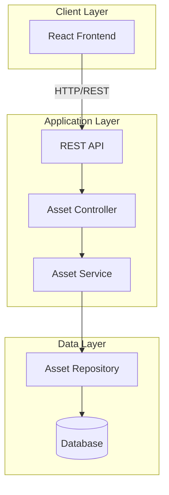

# Design Document: PIBIT.AI CMS

## 1. System Overview

The PIBIT.AI CMS is a lightweight Content Management System for managing digital assets via manually provided URLs. The system enables CRUD operations on assets, displays them by category, and provides a simple interface accessible over LAN.

## 2. High-Level Architecture

### 2.1 System Architecture Diagram



### 2.2 Technology Stack

- **Frontend**: React with TypeScript
- **Backend**: Node.js with Express (or Spring Boot alternative)
- **Database**: MongoDB (or MySQL alternative)
- **API**: RESTful architecture

## 3. Component Design

### 3.1 Frontend Components (React)

```
src/
├── components/
│   ├── AssetList.tsx
│   ├── AssetCard.tsx
│   ├── AssetForm.tsx
│   ├── CategoryFilter.tsx
│   └── Layout.tsx
├── services/
│   └── assetService.ts
├── types/
│   └── asset.ts
└── App.tsx
```

### 3.2 Backend Components

```
src/
├── controllers/
│   └── assetController.ts
├── services/
│   └── assetService.ts
├── repositories/
│   └── assetRepository.ts
├── models/
│   └── asset.ts
├── routes/
│   └── assetRoutes.ts
└── server.ts
```

## 4. Data Models

### 4.1 Asset Entity

```typescript
interface Asset {
  id: string;
  name: string;
  url: string;
  category: string;
  description: string;
  createdAt: Date;
  updatedAt: Date;
}
```

### 4.2 Database Schema (MongoDB)

```javascript
const AssetSchema = new Schema({
  name: { type: String, required: true },
  url: { type: String, required: true },
  category: { type: String, required: true },
  description: { type: String, default: '' },
  createdAt: { type: Date, default: Date.now },
  updatedAt: { type: Date, default: Date.now }
});
```

## 5. API Design

### 5.1 REST Endpoints

| Method | Endpoint | Description |
|--------|----------|-------------|
| GET | /api/assets | Get all assets |
| GET | /api/assets/:id | Get asset by ID |
| GET | /api/assets/category/:category | Get assets by category |
| POST | /api/assets | Create new asset |
| PUT | /api/assets/:id | Update asset |
| DELETE | /api/assets/:id | Delete asset |
| GET | /api/categories | Get all categories |

### 5.2 Request/Response Formats

**Create Asset (POST /api/assets)**
```json
Request:
{
  "name": "Company Logo",
  "url": "https://example.com/logo.png",
  "category": "Images",
  "description": "Main company logo"
}

Response:
{
  "id": "123",
  "name": "Company Logo",
  "url": "https://example.com/logo.png",
  "category": "Images",
  "description": "Main company logo",
  "createdAt": "2026-04-15T10:00:00Z",
  "updatedAt": "2026-04-15T10:00:00Z"
}
```

## 6. Low-Level Design

### 6.1 Asset Controller

```typescript
class AssetController {
  constructor(private assetService: AssetService) {}

  async getAllAssets(req: Request, res: Response): Promise<void> {
    // Get all assets from service
    // Return 200 with assets array
  }

  async getAssetById(req: Request, res: Response): Promise<void> {
    // Extract id from params
    // Get asset from service
    // Return 200 with asset or 404 if not found
  }

  async createAsset(req: Request, res: Response): Promise<void> {
    // Validate request body
    // Create asset via service
    // Return 201 with created asset
  }

  async updateAsset(req: Request, res: Response): Promise<void> {
    // Extract id and data
    // Update via service
    // Return 200 with updated asset or 404
  }

  async deleteAsset(req: Request, res: Response): Promise<void> {
    // Extract id
    // Delete via service
    // Return 204 or 404
  }
}
```

### 6.2 Asset Service

```typescript
class AssetService {
  constructor(private repository: AssetRepository) {}

  async findAll(): Promise<Asset[]> {
    return await this.repository.findAll();
  }

  async findById(id: string): Promise<Asset | null> {
    return await this.repository.findById(id);
  }

  async findByCategory(category: string): Promise<Asset[]> {
    return await this.repository.findByCategory(category);
  }

  async create(assetData: CreateAssetDTO): Promise<Asset> {
    // Validate URL format
    // Create asset entity
    // Save via repository
    return await this.repository.save(assetData);
  }

  async update(id: string, assetData: UpdateAssetDTO): Promise<Asset | null> {
    // Check if exists
    // Validate data
    // Update via repository
    return await this.repository.update(id, assetData);
  }

  async delete(id: string): Promise<boolean> {
    return await this.repository.delete(id);
  }

  async getAllCategories(): Promise<string[]> {
    const assets = await this.repository.findAll();
    return [...new Set(assets.map(a => a.category))];
  }
}
```

### 6.3 Asset Repository

```typescript
class AssetRepository {
  constructor(private db: Database) {}

  async findAll(): Promise<Asset[]> {
    return await this.db.collection('assets').find().toArray();
  }

  async findById(id: string): Promise<Asset | null> {
    return await this.db.collection('assets').findOne({ _id: id });
  }

  async findByCategory(category: string): Promise<Asset[]> {
    return await this.db.collection('assets').find({ category }).toArray();
  }

  async save(asset: CreateAssetDTO): Promise<Asset> {
    const result = await this.db.collection('assets').insertOne({
      ...asset,
      createdAt: new Date(),
      updatedAt: new Date()
    });
    return { id: result.insertedId, ...asset };
  }

  async update(id: string, data: UpdateAssetDTO): Promise<Asset | null> {
    const result = await this.db.collection('assets').findOneAndUpdate(
      { _id: id },
      { $set: { ...data, updatedAt: new Date() } },
      { returnDocument: 'after' }
    );
    return result.value;
  }

  async delete(id: string): Promise<boolean> {
    const result = await this.db.collection('assets').deleteOne({ _id: id });
    return result.deletedCount > 0;
  }
}
```

## 7. Frontend Design

### 7.1 Main Components

**AssetList Component**
```typescript
interface AssetListProps {
  category?: string;
}

const AssetList: React.FC<AssetListProps> = ({ category }) => {
  const [assets, setAssets] = useState<Asset[]>([]);
  const [loading, setLoading] = useState(true);

  useEffect(() => {
    // Fetch assets from API
    // Filter by category if provided
  }, [category]);

  return (
    // Render asset cards grouped by category
  );
};
```

**AssetForm Component**
```typescript
interface AssetFormProps {
  asset?: Asset;
  onSubmit: (data: AssetFormData) => void;
  onCancel: () => void;
}

const AssetForm: React.FC<AssetFormProps> = ({ asset, onSubmit, onCancel }) => {
  // Form state management
  // Validation
  // Submit handler
};
```

### 7.2 Service Layer (Frontend)

```typescript
class AssetService {
  private baseUrl = '/api/assets';

  async getAll(): Promise<Asset[]> {
    const response = await fetch(this.baseUrl);
    return response.json();
  }

  async getById(id: string): Promise<Asset> {
    const response = await fetch(`${this.baseUrl}/${id}`);
    return response.json();
  }

  async create(data: CreateAssetDTO): Promise<Asset> {
    const response = await fetch(this.baseUrl, {
      method: 'POST',
      headers: { 'Content-Type': 'application/json' },
      body: JSON.stringify(data)
    });
    return response.json();
  }

  async update(id: string, data: UpdateAssetDTO): Promise<Asset> {
    const response = await fetch(`${this.baseUrl}/${id}`, {
      method: 'PUT',
      headers: { 'Content-Type': 'application/json' },
      body: JSON.stringify(data)
    });
    return response.json();
  }

  async delete(id: string): Promise<void> {
    await fetch(`${this.baseUrl}/${id}`, { method: 'DELETE' });
  }
}
```

## 8. Error Handling

### 8.1 Error Response Format

```typescript
interface ErrorResponse {
  error: {
    code: string;
    message: string;
    details?: any;
  };
}
```

### 8.2 Error Codes

- `ASSET_NOT_FOUND`: Asset with given ID not found
- `INVALID_URL`: URL format is invalid
- `VALIDATION_ERROR`: Request data validation failed
- `DATABASE_ERROR`: Database operation failed

## 9. Performance Optimization

### 9.1 Caching Strategy
- Cache category list in memory
- Implement pagination for large asset lists
- Use database indexing on category field

### 9.2 Response Time Targets
- API response: < 500ms
- Page load: < 2 seconds
- Asset list rendering: < 1 second

## 10. Security Considerations

### 10.1 LAN-Only Access
- No authentication required
- Bind server to local network interface only
- No external API exposure

### 10.2 Input Validation
- Validate URL format
- Sanitize user inputs
- Prevent XSS attacks in descriptions

## 11. Correctness Properties

*A property is a characteristic or behavior that should hold true across all valid executions of a system—essentially, a formal statement about what the system should do. Properties serve as the bridge between human-readable specifications and machine-verifiable correctness guarantees.*

### Property 1: URL Validation Consistency

*For any* string input, the URL validation function SHALL consistently identify valid URLs according to the URL format specification and reject invalid URLs with the INVALID_URL error code.

**Validates: Requirements 1.2, 1.8, 9.1, 10.4**

### Property 2: Asset Creation Persistence

*For any* valid asset data (with valid name, URL, and category), creating an asset SHALL result in the asset being persisted to the database with a unique ID, createdAt timestamp, updatedAt timestamp, and all provided fields intact.

**Validates: Requirements 1.3, 1.4, 1.5, 1.6, 11.1**

### Property 3: Asset Creation Success Response

*For any* valid asset creation request, the API SHALL return HTTP status 201 with the complete created asset including all fields (id, name, url, category, description, createdAt, updatedAt).

**Validates: Requirements 1.7**

### Property 4: Asset Retrieval by ID

*For any* asset that exists in the database, retrieving it by its ID SHALL return HTTP status 200 with the complete asset data matching what was stored.

**Validates: Requirements 2.4**

### Property 5: Non-Existent Asset Returns 404

*For any* asset ID that does not exist in the database, attempts to retrieve, update, or delete that asset SHALL return HTTP status 404.

**Validates: Requirements 2.5, 3.7, 4.4, 10.3**

### Property 6: Category Filtering Correctness

*For any* category value and any collection of assets in the database, filtering by that category SHALL return only assets where the category field exactly matches the filter value.

**Validates: Requirements 2.6, 2.7**

### Property 7: Asset Update Persistence

*For any* existing asset and any valid update data, updating the asset SHALL persist the changes to the database, update the updatedAt timestamp to the current time, and preserve the original createdAt timestamp.

**Validates: Requirements 3.4, 3.5, 11.2**

### Property 8: Asset Update Success Response

*For any* valid asset update request for an existing asset, the API SHALL return HTTP status 200 with the complete updated asset reflecting all changes.

**Validates: Requirements 3.6**

### Property 9: Asset Deletion Persistence

*For any* existing asset, deleting the asset SHALL remove it from the database such that subsequent retrieval attempts return 404.

**Validates: Requirements 4.2, 11.3**

### Property 10: Asset Deletion Success Response

*For any* successful asset deletion, the API SHALL return HTTP status 204 with no response body.

**Validates: Requirements 4.3**

### Property 11: Category Extraction Uniqueness

*For any* collection of assets in the database, extracting categories SHALL return only unique category values with no duplicates, regardless of how many assets share each category.

**Validates: Requirements 5.2, 5.3**

### Property 12: Frontend Category Filtering

*For any* category filter value provided to the AssetList component, the component SHALL fetch and display only assets matching that category.

**Validates: Requirements 6.2**

### Property 13: Asset Card Display Completeness

*For any* asset rendered as an asset card, the rendered output SHALL include the asset's name, URL, category, and description fields.

**Validates: Requirements 6.5**

### Property 14: Asset Form Population

*For any* existing asset provided to the AssetForm component, all form fields SHALL be populated with the corresponding asset data values.

**Validates: Requirements 7.2**

### Property 15: Form Validation Execution

*For any* form submission in the AssetForm component, validation SHALL be performed on the form data before invoking the onSubmit callback.

**Validates: Requirements 7.3**

### Property 16: Valid Form Submission Callback

*For any* valid form data submitted in the AssetForm component, the onSubmit callback SHALL be invoked with the complete form data.

**Validates: Requirements 7.4**

### Property 17: Input Sanitization for XSS Prevention

*For any* user input string (including descriptions), the CMS SHALL sanitize the input to remove or escape potentially malicious content that could cause XSS attacks.

**Validates: Requirements 9.2, 9.3**

### Property 18: Error Response Structure

*For any* error condition in the API, the error response SHALL include an error object with both a code field and a message field.

**Validates: Requirements 10.1, 10.2**

### Property 19: Validation Error Code

*For any* request that fails validation, the API SHALL return error code VALIDATION_ERROR.

**Validates: Requirements 10.5**

### Property 20: Required Field Validation

*For any* asset creation or update request, if any required field (name, url, or category) is missing, the API SHALL reject the request with a VALIDATION_ERROR.

**Validates: Requirements 13.2, 13.3, 13.4**

### Property 21: Description Field Default

*For any* asset created without a description field, the asset SHALL be stored with the description field set to an empty string.

**Validates: Requirements 13.5**

### Property 22: Asset Data Model Structure

*For any* asset stored in or retrieved from the database, the asset SHALL have all required fields: id (string), name (string), url (string), category (string), description (string), createdAt (Date), and updatedAt (Date).

**Validates: Requirements 13.1, 13.6, 13.7**

### Property 23: Frontend Service API Call Correctness

*For any* ID value provided to AssetService methods (getById, update, delete), the service SHALL make the API call to the correct endpoint with the ID properly included in the URL path.

**Validates: Requirements 14.3, 14.5, 14.6**

### Property 24: Frontend Service POST/PUT Data Transmission

*For any* asset data provided to AssetService create or update methods, the service SHALL transmit the complete data in the request body as JSON.

**Validates: Requirements 14.4, 14.5**

### Property 25: Environment Configuration Handling

*For any* valid PORT value provided via environment variable, the CMS SHALL bind the server to that port number.

**Validates: Requirements 15.1**

### Property 26: Database URL Configuration

*For any* valid DATABASE_URL provided via environment variable, the CMS SHALL establish the database connection using that URL.

**Validates: Requirements 15.2**

## 12. Testing Strategy

### 12.1 Unit Tests
- Service layer logic
- Repository operations
- Component rendering

### 12.2 Integration Tests
- API endpoint testing
- Database operations
- End-to-end workflows

### 12.3 Property-Based Tests
- All properties defined in Section 11 must be implemented as property-based tests
- Minimum 100 iterations per property test
- Each test must reference its design document property using tags

## 13. Deployment

### 13.1 Development Environment
```bash
# Frontend
npm run dev

# Backend
npm run start:dev
```

### 13.2 Production Build
```bash
# Frontend
npm run build

# Backend
npm run build
npm run start
```

### 13.3 Environment Variables
```
PORT=3000
DATABASE_URL=mongodb://localhost:27017/pibit-cms
NODE_ENV=production
```
